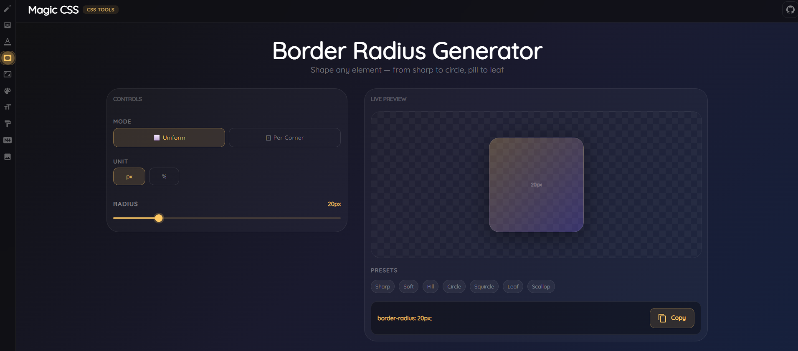
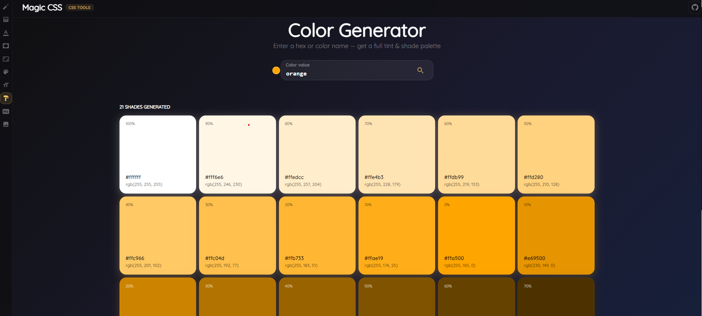
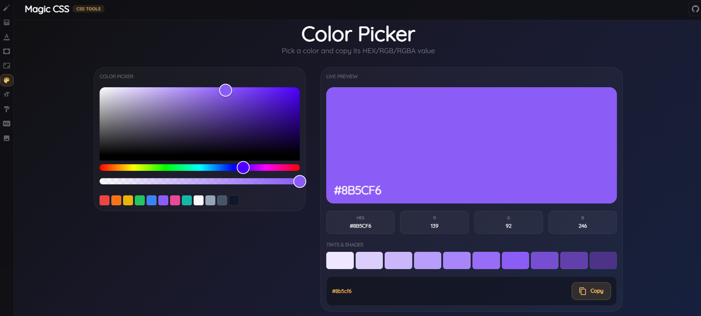
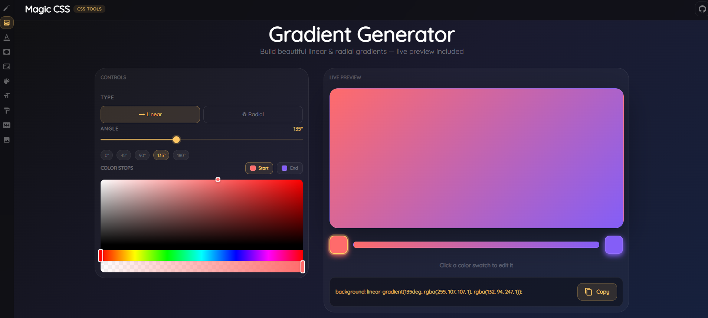
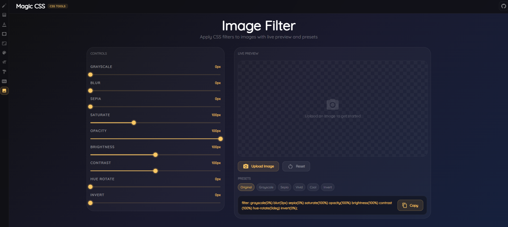
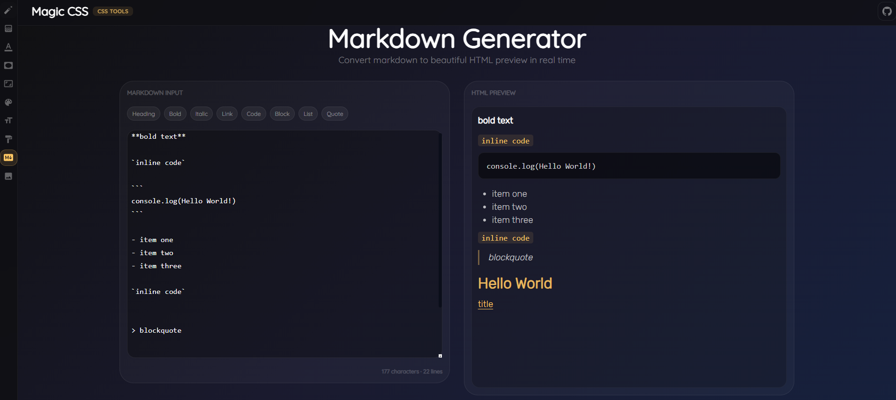
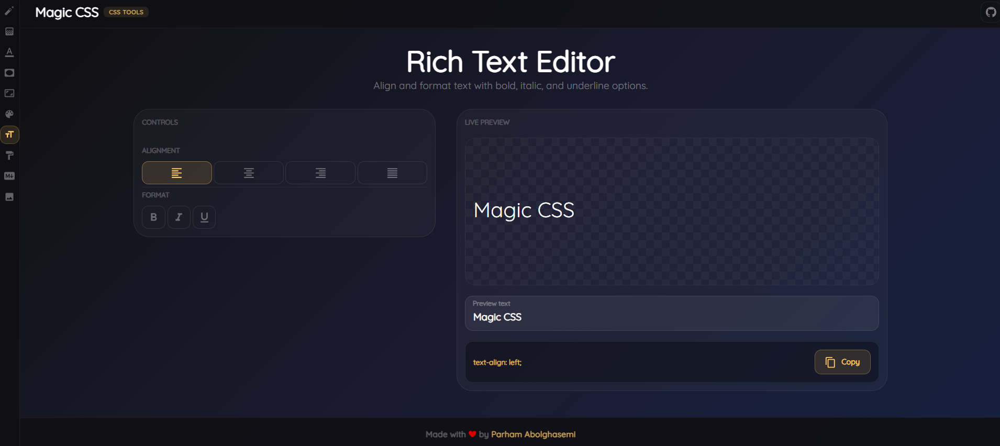
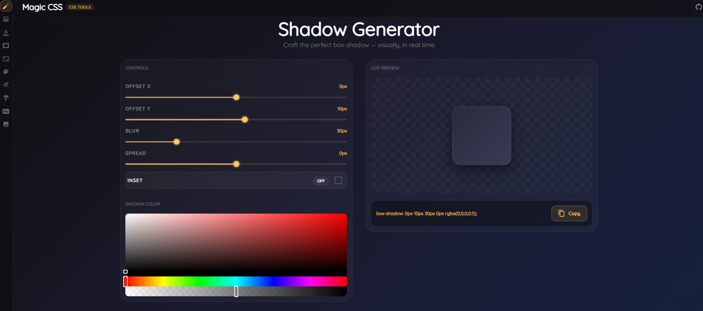
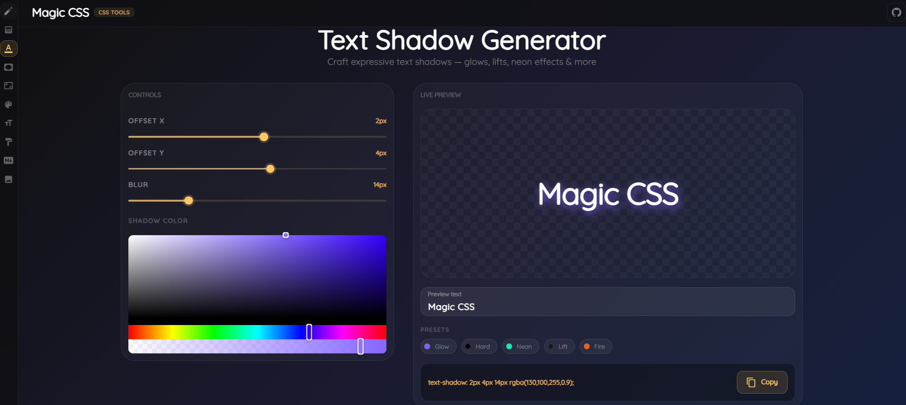
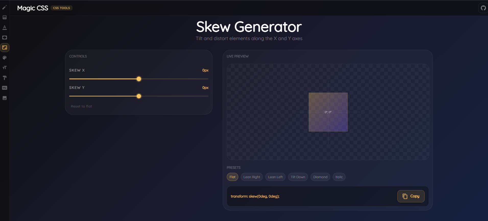

# ✨ Magic CSS

> **A collection of powerful CSS utility generators to streamline your web design workflow**

🎨 Create stunning CSS effects and utilities with interactive tools. Generate border-radius, gradients, shadows, filters, and more with real-time preview and instant copy-to-clipboard functionality.

[](https://magic-css-parham-ab.netlify.app/)

---

## 🚀 Features

Magic CSS provides a comprehensive suite of interactive CSS generators:

### 🔲 Border Radius Generator

Create perfect rounded corners with interactive sliders and visual preview.



### 🎨 Color Generator

Generate harmonious color palettes and explore color variations effortlessly.



### 🌈 Color Picker

Pick and manage colors with an intuitive color selection interface.



### 🌅 Gradient Generator

Design beautiful CSS gradients with multiple color stops and directions.



### 📸 Image Filter

Apply stunning CSS filters to your images with real-time preview.



### 📝 Markdown Generator

Convert your CSS and styling into markdown documentation.



### ✍️ Text Editor

Rich text editor with live CSS styling capabilities.



### 🎭 Shadow Generator

Create beautiful box shadows with intuitive controls.



### 🔤 Text Shadow Generator

Design eye-catching text shadows with multiple presets.



### 📐 Skew Generator

Apply dynamic skew transformations to elements.



---

## 💡 Key Features

✅ **Interactive Real-Time Preview** - See changes instantly as you adjust parameters  
✅ **One-Click Copy to Clipboard** - Easily copy generated CSS code  
✅ **Multiple Presets** - Quick access to popular configurations  
✅ **Responsive Design** - Works seamlessly on all devices  
✅ **Beautiful UI** - Modern Material-UI design system  
✅ **No Dependencies Required** - Pure CSS generation

---

## 🛠️ Tech Stack

- **React 18** - Modern UI framework
- **Material-UI (MUI)** - Component library
- **Sass** - CSS preprocessing
- **React Router** - Client-side routing
- **React Icons** - Icon library
- **React Hot Toast** - Notifications
- **React Colorful** - Color picker component
- **Emotion** - CSS-in-JS styling

---

## 📦 Installation

### Prerequisites

- Node.js (v14 or higher)
- npm or yarn

### Setup

1. **Clone the repository**

   ```bash
   git clone https://github.com/parham-ab/React-magic-css.git
   cd magic-css
   ```

2. **Install dependencies**

   ```bash
   npm install
   ```

3. **Start the development server**

   ```bash
   npm start
   ```

   Open [http://localhost:3000](http://localhost:3000) in your browser

4. **Build for production**
   ```bash
   npm run build
   ```

---

## 🎯 How to Use

1. **Navigate** to the tool you want to use
2. **Adjust** parameters using interactive controls and sliders
3. **Preview** changes in real-time
4. **Copy** the generated CSS code with one click
5. **Use** in your projects!

---

## 🌐 Live Demo

Experience Magic CSS live: [https://magic-css-parham-ab.netlify.app/](https://magic-css-parham-ab.netlify.app/)

---

## 📝 Available Scripts

### `npm start`

Runs the app in development mode. Open [http://localhost:3000](http://localhost:3000) to view it in your browser.

### `npm run build`

Builds the app for production to the `build` folder with optimizations.

### `npm test`

Launches the test runner in interactive watch mode.

---

## 🤝 Contributing

Contributions are welcome! Feel free to:

- Report bugs
- Suggest new generators
- Improve existing features
- Enhance documentation

---

## 📄 License

This project is open source and available under the MIT License.

---

## 🎉 Acknowledgments

Built with React, Material-UI, and ❤️

---

**Happy Styling! ✨**
